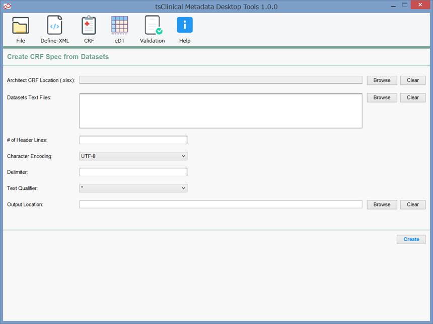

# User's Guide - tsClinical Metadata Desktop Tools
Version 1.0.3

### 1. 各機能の説明
#### 1.1. Convert from Excel to Define-XML

|入力項目|説明|
|:---|:---|
|Define-XML Version|作成するDefine-XMLのバージョンを指定します。「2.0.0」のみ選択できます。|
|Dataset Type|「SDTM」「ADaM」「SEND」から選択します。|
|Include Result Metadata|Dataset TypeがADaMの場合のみ指定できます。チェックを付けるとAnalysis Result Metadataを含んだDefine-XMLが作成されます。|
|XML Encoding|作成するDefine-XMLの文字コードを指定します。この文字コードでDefine-XMLが作成され、またXMLヘッダーのencodingに書き込まれます。「UTF-8」のみ選択できます。|
|Stylesheet Location (.xsl)|Define-XMLのスタイルシートの相対パスを指定します。この値がXMLスタイルシート参照のhrefに書き込まれます。|
|Data Source Location|Define-XMLの基になる情報を記載したExcelファイル（ファイル形式は.xlsxのみ）を指定します。Excelファイルは本ソフトウェアの`excel`フォルダに格納されているテンプレートを基に作成してください。|
|Output Location|Define-XMLが作成されるフォルダを指定します。ファイル名はデフォルトで"define.xml"と表示されますが、変更することができます。|

* ExcelとDefine-XML間のマッピングルールは`Mapping_Design_Define.xlsx`を参照してください。
* Excelの一部のカラムは、１つのセル内に「;」で区切ることで複数の情報を列記することができます。上記の区切り文字を変更したい場合は、本ソフトウェアの`properties`フォルダにある`main.properties`ファイルをテキストエディタで開き、"valueDelimiter"の値を変更します。CRF Page Reference列に複数のCRFページを記載する場合は、Define-XMLの規程通り、「;」ではなくスペースで区切ってください（例：「9 14 22」）。どのカラムが複数入力可能かは`Mapping_Design_Define.xlsx`を参照してください。
* Excelファイルの各セルの書式設定（標準形式）には「標準」または「文字列」を選択してください。これ以外の書式（「日付」や「ユーザ定義」、SUM関数等の計算式等）を設定した場合、Excelに表示されている文字とは異なる値がDefine-XMLに反映される可能性があります。
* SDTMのNon-Standard Variables (NSVs)のExcel記載方法は、(1) SUPP--データセットを定義する方法、(2) SDTMの通常の変数と同様に親データセットにNSVを記載する方法、があります。(2)の方法で記載した場合、以下のカラムを記載することで、本ソフトウェアはSUPP--データセット用の情報をDefine-XMLに自動生成します。詳細なマッピングルールは`Mapping_Design_Define.xlsx`のSUPPQUALシートを参照してください。
  * DATASETシートのHas SUPP列（※Has SUPP="Yes"の場合、Define-XMLにSUPP--データセットを生成します）
  * VARIABLEシートのIs SUPP列（※Is SUPP="Yes"の場合、そのデータセットのSUPP--のQVALのValue Level Metadataを生成する。）

#### 1.2. Convert from Define-XML to Excel

|入力項目|説明|
|:---|:---|
|Define-XML Version|インポートするDefine-XMLのバージョンを指定します。「2.0.0」のみ選択できます。|
|Dataset Type|「SDTM」「ADaM」「SEND」から選択します。|
|Data Source Location|インポートするDefine-XMLのxmlファイル（ファイル形式は.xmlのみ）を指定します。|
|Output Location|Excelが作成されるフォルダを指定します。ファイル名はデフォルトで"define.xlsx"と表示されますが、変更することができます。|

* ExcelとDefine-XML間のマッピングルールは`Mapping_Design_Define.xlsx`を参照してください。
* インポートするDefine-XMLに重大なエラーがあった場合、エラーが表示され、Excelは生成されません。重大なエラーは`src/main/resources/schema/hard`フォルダに含まれるXMLスキーマにより検証しています。主な検証内容は以下の通りです。
  * define.xmlが整形式(well-formed)でない
  * 必須であるOID項目が省略されている、またはOIDの参照先に対応するOIDが存在しない
* Output Locationに設定したExcelファイルが開かれているなど、他のプログラムからアクセスされている場合は書き込みができません。
* 本ソフトウェアは、SDTMのNon-Standard Variables (NSVs)をExcelにインポートする際、"SUPP--"データセットではなく、以下の要領で親データセットにNSVを追加します。詳細なマッピングルールは`Mapping_Design_Define.xlsx`のSUPPQUALシートを参照してください。
  * DATASETシートのHas SUPP列に"Yes"を設定
  * VARIABLEシートのIs SUPP列に"Yes"を設定

#### 1.3. Convert from Excel to ODM-XML

|入力項目|説明|
|:---|:---|
|ODM Version|作成するODM-XMLのバージョンを指定します。「1.3.2」のみ選択できます。|
|XML Encoding|作成するODM-XMLの文字コードを指定します。この文字コードでODMが作成され、またXMLヘッダーのencodingに書き込まれます。「UTF-8」のみ選択できます。|
|Stylesheet Location (.xsl)|ODM-XMLのスタイルシートの相対パスを指定します。この値がXMLスタイルシート参照のhrefに書き込まれます。※スタイルシートが無い場合は本欄は空白で構いません。|
|Data Source Location|ODM-XMLの基になる情報を記載したExcelファイル（ファイル形式は.xlsxのみ）を指定します。Excelファイルは本ソフトウェアのexcelフォルダに格納されているテンプレートを基に作成してください。|
|Output Location|ODM-XMLが作成されるフォルダを指定します。ファイル名はデフォルトで"odm.xml"と表示されますが、変更することができます。|

* ExcelとODM-XML間のマッピングルールは`Mapping_Design_ODM.xlsx`を参照してください。
* Excelの一部のカラムは、１つのセル内に「;」で区切ることで複数の情報を列記することができます。上記の区切り文字を変更したい場合は、本ソフトウェアの`properties`フォルダにある`main.properties`ファイルをテキストエディタで開き、"valueDelimiter"の値を変更します。どのカラムが複数入力可能かは`Mapping_Design_ODM.xlsx`を参照してください。
* Excelファイルの各セルの書式設定（標準形式）には「標準」または「文字列」を選択してください。これ以外の書式（「日付」や「ユーザ定義」、SUM関数等の計算式等）を設定した場合、Excelに表示されている文字とは異なる値がDefine-XMLに反映される可能性があります。
* 本機能はExcelに記述されたメタデータをODM形式で出力することを目的とした機能です。本ソフトウェアを用いて臨床試験データをODM形式で出力することはできません。
* 以下の要素・属性は出力されません。

|出力されない要素|出力されない属性|
|:---|:---|
|/ODM|Granularity, Archival, PriorFileOID|
|/ODM/Description|-|
|/ODM/Study/BasicDefinitions/MeasurementUnit/Alias|-|
|/ODM/Study/MetaDataVersion/Include|-|
|/ODM/Study/MetaDataVersion/Protocol/Alias|-|
|/ODM/Study/MetaDataVersion/FormDef/ArchiveLayout|PresentationOID|
|/ODM/Study/MetaDataVersion/ItemGroupDef|Domain, Origin, Role, Purpose, Comment|
|/ODM/Study/MetaDataVersion/ItemGroupDef/ItemRef|Role, RoleCodeListOID|
|/ODM/Study/MetaDataVersion/ItemDef|SDSVarName, Origin, Comment|
|/ODM/Study/MetaDataVersion/ItemDef/ExternalQuestion|-|
|/ODM/Study/MetaDataVersion/CodeList/ExternalCodeList|-|
|/ODM/Study/MetaDataVersion/Presentation|-|
|/ODM/AdminData|-|
|/ODM/ReferenceData|-|
|/ODM/ClinicalData|-|
|/ODM/Association|-|
|/ODM/ds:Signature|-|

* 各要素のOID属性は、`main.properties`の"oidMode"の値に応じて、ExcelファイルのID列に指定した値を基に出力されます。詳細は本書の[main.properties](#main.properties)を参照してください。
* UNITシートでは1つのIDに対し複数言語のSymbolを定義する場合は、1つのSymbolに対して1行で記載してください。この時、「ID」および「Name」も記載してください。
* EVENTxFORMシートの「Event Name」、「Form Name」、およびFIELDシートの「Form Name」、「Unit Name」には、（IDではなく）それぞれNameを記載してください。
* FIELDシートの各フォームにItemGroupの定義が含まれていない（各フォームに対して「Level」の値が0から開始している）場合、ODM-XMLで必須であるため本ソフトウェアは自動的にItemGroupを作成します。この時、「ID」はFormOID、「Name」は"DEFAULT_n"（nは連番）、「Mandatory」および「Repeating」はFORMシートと同じ値を使用します。

#### 1.4. Convert from ODM-XML to Excel

|入力項目|説明|
|:---|:---|
|ODM Version|インポートするODM-XMLのバージョンを指定します。「1.3.2」のみ選択できます。|
|Data Source Location|インポートするODM-XMLのxmlファイル（ファイル形式は.xmlのみ）を指定します。|
|Output Location|Excelが作成されるフォルダを指定します。ファイル名はデフォルトで”odm.xlsx”と表示されますが、変更することができます。|

* ExcelとODM-XML間のマッピングルールは`Mapping_Design_ODM.xlsx`を参照してください。
* インポートするODM-XMLに重大なエラーがあった場合、エラーが表示され、Excelは生成されません。重大なエラーは`src/main/resources/schema/hard`フォルダに含まれるXMLスキーマにより検証しています。主な検証内容は以下の通りです。
  * odm.xmlが整形式(well-formed)でない
  * 必須であるOID項目が省略されている、またはOIDの参照先に対応するOIDが存在しない
* Output Locationに設定したExcelファイルが開かれているなど、他のプログラムからアクセスされている場合は書き込みができません。

#### 1.5. Create CRF Spec from Datasets

|入力項目|説明|
|:---|:---|
|Architect CRF Location (.xlsx)|Medidata Rave EDCのArchitect Loader Draft Spreadsheet（ファイル形式は.xlsxのみ）を指定します。|
|Datasets Text Files|EDCから出力したデータセットファイル（表形式のテキストファイル、複数可）を指定します。|
|# of Header Lines|Datasets Text Filesを設定した場合に入力が必要です。テキストファイルのヘッダー行の数（1以上）を入力します。|
|Character Encoding	Datasets|Text Filesを設定した場合に入力が必要です。テキストファイルの文字コードを「UTF-8」「ISO-8859-1」「Shift_JIS」から指定します。|
|Delimiter|Datasets Text Filesを設定した場合に入力が必要です。テキストファイルの区切り文字（1文字またはタブ（\t））を入力します。|
|Text Qualifier|Datasets Text Filesを設定した場合に入力が必要です。各列の囲み文字を「"」「'」から選択します。囲み文字が無い場合は「(None)」を選択します。|
|Output Location|Excelが作成されるフォルダを指定します。ファイル名はデフォルトで"crf_spec.xlsx"と表示されますが、変更することができます。|

* Architect CRFまたはDatasets Text Filesのどちらか、または両方を指定してCRF Specを作成することができます。[\*1]
* Architect CRFとDatasets Text Filesの両方を指定した場合、Fieldの一覧はDataset Text Filesの内容が優先します（データセットに無いArchitect CRFのFieldはCRF Specに作成されません）。各Fieldのプロパティの内容やCodelistの内容はArchitect CRFの内容が優先します。
* CRF SpecとArchitect CRF間のマッピングテーブルは`Mapping_Design_Architect.xlsx`[\*2]を参照してください。
* データセットからCodelistの内容を生成する際、データセットの最大10,000レコードのみ参照されます。
* データセットからDataTypeを導出する際、データセットの最初のレコードのみ参照されます。

[\*1] Architect CRFに関する機能はGitHubに公開していません。  
[\*2] 本文書はGitHubに公開していません。

#### 1.6. Create eDT Spec from Datasets

|入力項目|説明|
|:---|:---|
|Type|外部データの種類を選択します。|
|# of Header Lines|テキストファイルのヘッダー行の数（1以上）を入力します。|
|Character Encoding|テキストファイルの文字コードを「UTF-8」「ISO-8859-1」「Shift_JIS」から指定します。|
|Delimited/Fixed Width|テキストファイルの種類を選択します。「Delimited」のみ選択できます。|
|Delimiter|テキストファイルの区切り文字（1文字またはタブ（\t））を入力します。|
|Text Qualifier|各列の囲み文字を「"」「'」から選択します。囲み文字が無い場合は「(None)」を選択します。|
|Data Source Location|外部データのデータセットファイルを指定します。（表形式のテキストファイル、複数不可）|
|Output Location|Excelが作成されるフォルダを指定します。ファイル名はデフォルトで"edt_spec.xlsx"と表示されますが、変更することができます。|

* データセットからCodelistの内容を生成する際、データセットの最大10,000レコードのみ参照されます。
* データセットからDataTypeを導出する際、データセットの最初のレコードのみ参照されます。

#### 1.7. Validate XML against XML Schema

|入力項目|説明|
|:---|:---|
|XML File Location (.xml)|検証するXMLファイルを指定します。|
|Schema Location (.xsd)|XMLファイルを検証する対象となるXMLスキーマを指定します。|

* 本ソフトウェアではXML Schemaに対する検証を行うツールとして、CDISCが発行している文書"XML Schema Validation for Define.xml"に記載されているXerces 2.9.0を採用しています。
* XML Schemaに対する検証でエラーが抽出されない場合でも、Define-XMLやODM-XMLの仕様に完全に準拠していることを保証するものではありません。

### 2. main.properties

本ソフトウェアの`properties`フォルダに格納されている`main.properties`ファイル（初回起動時に自動作成されます）をテキストエディタで編集することにより、本ソフトウェアの設定を行うことができます。画面が閉じる際に画面上の設定内容が`main.properties`ファイルに上書きされます。画面上から設定された内容が優先されるため、通常はこのファイルを編集する必要はありません。

|入力項目|説明|
|:---|:---|
|defineStudyTableName|Define-XMLの生成においてExcelのStudyに関する情報を記載するシート名を指定します。|
|defineDocumentTableName|Define-XMLの生成においてExcelのDocumentに関する情報を記載するシート名を指定します。|
|defineDatasetTableName|Define-XMLの生成においてExcelのDomain/Datasetに関する情報を記載するシート名を指定します。|
|defineVariableTableName|Define-XMLの生成においてExcelのVariableに関する情報を記載するシート名を指定します。|
|defineValueTableName|Define-XMLの生成においてExcelのValueに関する情報を記載するシート名を指定します。|
|defineResult1TableName|Define-XMLの生成においてExcelのAnalysis Result Metadataに関する情報（Result DisplayおよびAnalysis Result）を記載するシート名を指定します。|
|defineResult2TableName|Define-XMLの生成においてExcelのAnalysis Result Metadataに関する情報（Analysis DatasetおよびWhere Clause）を記載するシート名を指定します。|
|defineDictionaryTableName|Define-XMLの生成においてExcelのDictionaryに関する情報を記載するシート名を指定します。|
|defineCodelistTableName|Define-XMLの生成においてExcelのCodelistに関する情報を記載するシート名を指定します。|
|valueDelimiter|Define-XMLの生成においてExcelの１つのセルに複数の値を記入する場合に区切り文字として取り扱われる文字を指定します。デフォルト値は「;」です。|
|e2dDefineVersion|Convert from Excel to Define-XML画面上の「Define-XML Version」と同じ項目です。|
|e2dDatasetType|Convert from Excel to Define-XML画面上の「Dataset Type」と同じ項目です。|
|e2dIncludeResultMetadata|Convert from Excel to Define-XML画面上の「Include Result Metadata」と同じ項目です。”true”（含める）または”false”（含めない）を指定します。|
|e2dXmlEncoding|Convert from Excel to Define-XML画面上の「XML Encoding」と同じ項目です。|
|e2dStylesheetLocation|Convert from Excel to Define-XML画面上の「Stylesheet Location (.xsl)」と同じ項目です。|
|e2dDataSourceLocation|Convert from Excel to Define-XML画面上の「Data Source Location」と同じ項目です。|
|e2dOutputLocation|Convert from Excel to Define-XML画面上の「Output Location」と同じ項目です。|
|d2eDefineVersion|Convert from Define-XML to Excel画面上の「Define-XML Version」と同じ項目です。|
|d2eDatasetType|Convert from Define-XML to Excel画面上の「Dataset Type」と同じ項目です。|
|d2eDataSourceLocation|Convert from Define-XML to Excel画面上の「Data Source Location」と同じ項目です。|
|d2eOutputLocation|Convert from Define-XML to Excel画面上の「Output Location」と同じ項目です。|
|odmStudyTableName|ODM-XMLの生成においてExcelのStudyに関する情報を記載するシート名を指定します。|
|odmUnitTableName|ODM-XMLの生成においてExcelのUnitに関する情報を記載するシート名を指定します。|
|odmEventTableName|ODM-XMLの生成においてExcelのEventに関する情報を記載するシート名を指定します。|
|odmEventFormTableName|ODM-XMLの生成においてExcelのEvent x Form（EventとFormの対応表）に関する情報を記載するシート名を指定します。|
|odmFormTableName|ODM-XMLの生成においてExcelのFormに関する情報を記載するシート名を指定します。|
|odmFieldTableName|ODM-XMLの生成においてExcelのField（ItemGroupおよびItem）に関する情報を記載するシート名を指定します。Level列の値が1の場合はItemGroupを表し、0の場合はItemを表します。|
|odmCodelistTableName|ODM-XMLの生成においてExcelのCodelistに関する情報を記載するシート名を指定します。|
|odmMethodTableName|ODM-XMLの生成においてExcelのMethodに関する情報を記載するシート名を指定します。|
|odmConditionTableName|ODM-XMLの生成においてExcelのConditionに関する情報を記載するシート名を指定します。|
|oidMode|ODM-XMLの生成においてのみ使用されるパラメタです。「EXACT」または「NATIVE」を指定できます。「EXACT」を指定した場合、ExcelのID列に指定した値がそのままODMのOID属性に設定されます。「NATIVE」を指定した場合、ExcelのID列に指定した値を基にODMのOID属性の値が自動的に生成されます。デフォルト値は「EXACT」です。|
|e2oOdmVersion|Convert from Excel to ODM-XML画面上の「ODM Version」と同じ項目です。|
|e2oXmlEncoding|Convert from Excel to ODM-XML画面上の「XML Encoding」と同じ項目です。|
|e2oStylesheetLocation|Convert from Excel to ODM-XML画面上の「Stylesheet Location (.xsl)」と同じ項目です。|
|e2oDataSourceLocation|Convert from Excel to ODM-XML画面上の「Data Source Location」と同じ項目です。|
|e2oOutputLocation|Convert from Excel to ODM-XML画面上の「Output Location」と同じ項目です。|
|o2eOdmVersion|Convert from ODM-XML to Excel画面上の「ODM Version」と同じ項目です。|
|o2eOdmLocation|Convert from ODM-XML to Excel画面上の「Data Source Location」と同じ項目です。|
|o2eOutputLocation|Convert from ODM-XML to Excel画面上の「Output Location」と同じ項目です。|
|crfArchitectLocation|Create CRF Spec from Datasets画面上の「Architect CRF Location (.xlsx)」と同じ項目です。|
|crfSourceFiles|Create CRF Spec from Datasets画面上の「Datasets Text Files」と同じ項目です。|
|crfHeaderCnt|Create CRF Spec from Datasets画面上の「# of Header Lines」と同じ項目です。|
|crfEncoding|Create CRF Spec from Datasets画面上の「Character Encoding」と同じ項目です。|
|crfDelimiter|Create CRF Spec from Datasets画面上の「Delimiter」と同じ項目です。|
|crfTextQualifier|Create CRF Spec from Datasets画面上の「Text Qualifier」と同じ項目です。|
|crfOutputLocation|Create CRF Spec from Datasets画面上の「Output Location」と同じ項目です。|
|edtGeneralTableName|eDT Specの生成においてExcelのGeneralに関する情報を記載するシート名を指定します。|
|edtColumnTableName|eDT Specの生成においてExcelのColumnに関する情報を記載するシート名を指定します。|
|edtCodelistTableName|eDT Specの生成においてExcelのCodelistに関する情報を記載するシート名を指定します。|
|edtType|Create eDT Spec from Datasets画面上の「Type」と同じ項目です。
|edtHeaderCnt|Create eDT Spec from Datasets画面上の「# of Header Lines」と同じ項目です。|
|edtEncoding|Create eDT Spec from Datasets画面上の「Character Encoding」と同じ項目です。|
|edtDelimitedOrFixed|Create eDT Spec from Datasets画面上の「Delimited/Fixed Width」と同じ項目です。|
|edtDelimiter|Create eDT Spec from Datasets画面上の「Delimiter」と同じ項目です。|
|edtTextQualifier|Create eDT Spec from Datasets画面上の「Text Qualifier」と同じ項目です。|
|edtDataSourceLocation|Create eDT Spec from Datasets画面上の「Data Source Location」と同じ項目です。|
|edtOutputLocation|Create eDT Spec from Datasets画面上の「Output Location」と同じ項目です。|
|validateXmlLocation|Validate XML against XML Schema画面上の「XML File Location (.xml)」と同じ項目です。|
|validateSchemaLocation|Validate XML against XML Schema画面上の「Schema Location (.xsd)」と同じ項目です。|

---
Copyright (c) 2020-2021 Fujitsu Limited. All rights reserved.  
All brand names and product names in this document are registered trademarks or trademarks of their respective holders.
